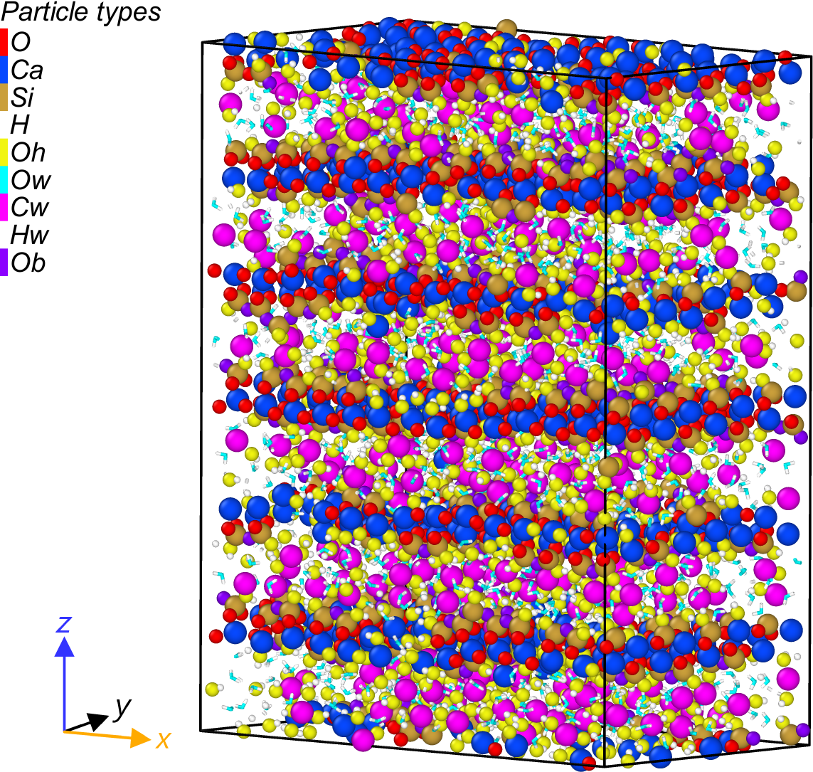

# High-Temperature Effects on Calcium-Silicate-Hydrates

## Project Abstract
This research project focuses on the computational studies of Calcium Silicate Hydrate (C-S-H) at high temperatures. Our goal is to explore and understand the structural, and mechanical behavior of CSH when exposed to high-temperature conditions. The study employs Molecular dynamics simulation. some of the input files, data files, and Python codes used for post-processing are also listed above.

## Illustration of the Supercell and atom types

## Literature Review
For a deeper understanding of the subject, a literature review has been conducted covering various aspects of high-temperature effects on CSH and computational techniques used in material science. The references have been organized and stored in the Zotero reference management software for easy access.

Please visit the following link to access the curated Zotero library: [Zotero Library](https://www.zotero.org/groups/5014044/csh_at_high_temperature/library).
You can also find an Excel spreadsheet listed above summarizing qualitative parameters, from NMR XRay TGA and Nanoindentation at various temperatures.  

## Acknowledgement

The computational model employed in this project is based on the work of Chiang Yuan, found at this [GitHub repository](https://github.com/chiang-yuan/csh4lmp). We express our gratitude to Chiang Yuan for providing such a comprehensive model that significantly contributed to the success of our project.

## Contributing
We welcome contributions to this project. If you find any issues or have suggestions, please open an issue in the issue tracker. If you wish to contribute code, please fork this repository and submit a pull request.

